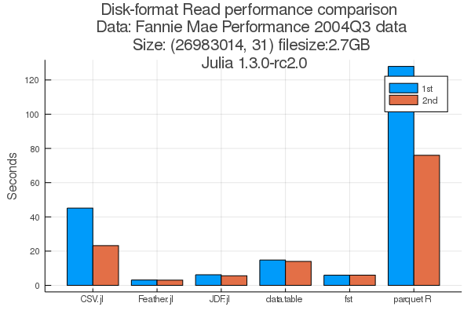
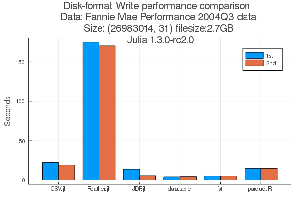
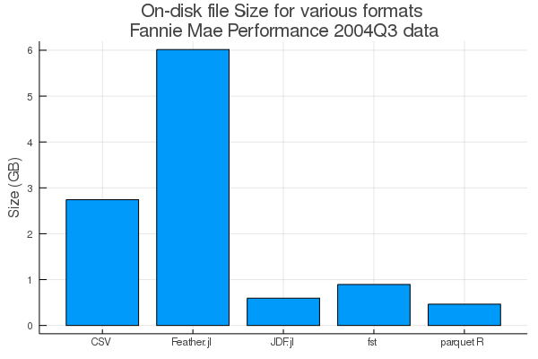

# JDF

A Julia `DataFrame`s serialization format with the following goals
* Fast save and load times
* Compressed storage on disk
* Enable disk-based data manipulation (not yet achieved; from v0.4.0)
* Supports machine learning workloads, e.g. mini-batch, sampling (not yet achieved; from v0.4.0)

JDF stores a `DataFrame` in a folder with each column stored as a separate file.
There is also a `metadata.jls` file that stores metadata about the original
`DataFrame`. Collectively, the column files, the metadata file, and the folder
is called a JDF "file".

## Please note

The next version of JDF which is v0.3 will contain breaking changes. But don't worry I am fully committed to providing an automatic upgrade path for JDF v0.2 users. This means that you can safely use JDF.jl v0.2 to save your data and not have to worry about the impending breaking change breaking all your JDF files.


## Example: Quick Start

```julia
using VegaDatasets, JDF, DataFrames

a = dataset("iris") |> DataFrame
```

### *Saving* and *Loading* data
By default JDF loads and saves `DataFrame`s using multiple threads starting from
Julia 1.3. For Julia < 1.3, it saves and loads using one thread only.

```julia
@time metadatas = savejdf("iris.jdf", a)
@time a2 = loadjdf("iris.jdf")
```

Simple checks for correctness
```julia
all(names(a2) .== names(a)) # true
all(skipmissing([all(a2[!,name] .== Array(a[!,name])) for name in names(a2)])) #true
```

### Loading only certain columns
You can load only a few columns from the dataset by specifying `cols =
[:column1, :column2]`. For example
```julia
a2_selected = loadjdf("iris.jdf", cols = [:species, :sepalLength, :petalWidth])
```
The difference with loading the whole datasets and then subsetting the columns
is that it saves time as only the selected columns are loaded from disk.

### Metadata Names & Size from disk
You can create a variable of type `JDFFile` that allows you to access some
metadata about the JDF on disk.

```julia
jdf"path/to/JDF.jdf"
```
or
```julia
JDFFile(path_to_JDF)
```
You can obtain the column names and size (`nrow` and `ncol`) of a JDF, for
example:


```julia
using JDF, DataFrames
df = DataFrame(a = 1:3, b = 1:3)
savejdf(df, "plsdel.jdf")


names(jdf"plsdel.jdf") # [:a, :b]

nrow(jdf"plsdel.jdf") # 3

ncol(jdf"plsdel.jdf") # 2

size(jdf"plsdel.jdf") # (3, 2)

size(jdf"plsdel.jdf", 1) # 2

size(jdf"plsdel.jdf", 2) # 3

# clean up
rm("plsdel.jdf", force = true, recursive = true)
```

### Save and load serially
You can use the `ssavejdf` and `sloadjdf` function to save a `DataFrame`
serially, i.e. without using parallel processes.
```julia
@time metadatas = ssavejdf("iris.jdf", a)
@time metadatas = sloadjdf("iris.jdf")
```

### Additional functionality: In memory `DataFrame` compression
`DataFrame` sizes are out of control. A 2GB CSV file can easily take up 10GB in
RAM. One can use the function `type_compress!(df)`  to compress any
`df::DataFrame`. E.g.

```julia
type_compress!(df)
```

The function looks at `Int*` columns and see if it can be safely "downgraded" to
another `Int*` type with a smaller bits size. It will convert `Float64` to
`Float32` if `compress_float = true`. E.g.

```julia
type_compress!(df, compress_float = true)
```

`String` compression is _planned_ and will likely employ categorical encoding
combined with RLE encoding.

## Benchmarks
Here are some benchmarks using the [Fannie Mae Mortgage
Data](https://docs.rapids.ai/datasets/mortgage-data). Please note that a reading
of zero means that the method has failed to read or write.

JDF is a decent performer on both read and write and can achieve comparable
performance to [R's {fst}](https://www.fstpackage.org/), once compiled. The JDF
format also results in much smaller file size vs Feather.jl in this particular
example (probably due to Feather.jl's inefficient storage of `Union{String,
Missing}`).





Please note that the benchmarks were obtained on Julia 1.3+. On earlier versions
of Julia where multi-threading isn't available, JDF is roughly 2x slower than as
shown in the benchmarks.

## Supported data types
I believe that restricting the types that JDF supports is vital for simplicity and maintainability.

There is support for
* `WeakRefStrings.StringVector`
* `Vector{T}`
* `CategoricalArrays.CategoricalVetors{T}`

where `T` can be `String`, `Bool`, `Symbol`, and `isbits` types i.e. `UInt*`, `Int*`,
and `Float*` `Date*` types etc.

`RLEVectors` support will be considered in the future when `missing` support
arrives for `RLEVectors.jl`.

## How does JDF work?
Although JDF is experimental, there are a few tricks up Julia's sleeve. Firstly,
this is a purely Julia solution and there are a lot of ways to do nifty things
like compression and encapsulating the underlying struture of the arrays that's
hard to do in R and Python. E.g. Python's numpy arrays are C objects, but all
the vector types used in JDF are Julia data types.

When saving a JDF, each vector is Blosc compressed (using the default settings)
if possible; this includes all `T` and `Unions{Missing, T}` types where `T` is
`isbits`. For `String` vectors, they are first converted to a  Run Length
Encoding (RLE) representation, and the lengths component in the RLE are `Blosc`
compressed.

## Development Plans
I fully intend to develop JDF.jl into a language neutral format by version v0.4. However, I have other OSS commitments including [R's
{disk.frame}](http:/diskframe.com) and hence new features might be slow to come onboard. But I am fully committed to making JDF files created using JDF.jl v0.2 or higher loadable in all future JDF.jl versions.

## Notes

* Julia 1.0 is not supported as the `serialize` function used by JDF.jl is only available from 1.1.
* Parallel read and write support is only available from Julia 1.3.
* The design of JDF was inspired by [fst](fstpackage.org) in terms of using compressions and allowing random-access to columns
